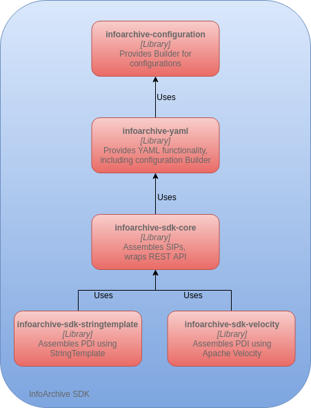

= Contributing to the InfoArchive SDK

First off, thanks for taking the time to contribute! Your efforts are much appreciated.

== What should I know before I get started?

This project is the InfoArchive _Software Development Kit_ (SDK). Its purpose is to make it easy to write applications
that connect with http://documentum.opentext.com/infoarchive/[OpenText InfoArchive]. It does NOT contain code for
InfoArchive itself, since that is not open source.

You should be familiar with InfoArchive concepts. Please read through the InfoArchive documentation, or at least take a
look at the https://github.com/Enterprise-Content-Management/infoarchive-sip-sdk-lab[lab project]. In particular, you
should be familiar with the concepts of _Submission Information Package_ (SIP) and _Preservation Description Information_
(PDI), as described by the http://www.oais.info/[OAIS Reference Model] for digital preservation.

You need access to a running InfoArchive server to invoke some of the SDK's functionality, like ingesting SIPs. Other
functionality, like assembling SIPs, can be used without such access.

== How Can I Contribute?

=== Reporting Bugs

Reporting a bug helps ensure that the project works for as many people and in as many environments as possible.

Before creating a bug report, please check the existing 
https://github.com/Enterprise-Content-Management/infoarchive-sip-sdk/issues[issues] as you might find that your problem
is already reported. If you find an issue that is still open, add a comment to the existing issue instead of opening a
new one. If you find a closed issue that seems like it is the same thing that you're experiencing, open a new issue and
include a link to the original issue in the body of your new one.

When creating an issue, be specific and include as many details as possible. 
https://www.chiark.greenend.org.uk/~sgtatham/bugs.html[This guide] will help you describe the problem in a manner that
maximizes the chances of it getting fixed as quickly as possible.

Please add the `bug` label to any issue that represents a bug.

=== Suggesting Enhancements

We love to hear about new uses cases that can make the SDK even more useful.

Suggesting an enhancement works similarly to reporting a bug in the sense that we use the same
https://github.com/Enterprise-Content-Management/infoarchive-sip-sdk/issues[issues] tracker for it.
Please add the `enhancement` label to any issue that represents an enhancement.

When suggesting an enhancement, make sure to explain the use case you're trying to solve. You may suggest a possible
solution or even implementation, but first and foremost you should focus on the problem. People more familiar with the
inner workings of the SDK may see other ways of solving the same problem.

=== Contributing Documentation

Having clear and concise documentation makes it easier to use the SDK. We have different types of documentation:

. The https://github.com/Enterprise-Content-Management/infoarchive-sip-sdk-lab[lab project] explains the important 
concepts that you need to know in order to work with InfoArchive and the SDK. It is a separate project in GitHub, so
we won't discuss it further here.
. The https://github.com/Enterprise-Content-Management/infoarchive-sip-sdk/wiki[Wiki] has a few pages on important
topics. This type of documentation focuses on specific tasks that can be accomplished with the SDK. If you'd like to
contribute to the wiki, use the `Clone this wiki locally` button and follow the process for contributing source code 
as explained below. This documentation assumes you are familiar with the main archiving concepts.
. The http://www.javadoc.io/doc/com.opentext.ia/infoarchive-sdk-core/[JavaDoc] is embedded in the source code. Updating
or adding JavaDoc thus follows the same process as changing the code, as described in the next section. JavaDoc focuses
on low-level details for a particular class or method. It assumes you are familiar with archiving concepts and know
what task to perform on a high level.

=== Contributing Source Code

All source code contributions must come in the form of https://help.github.com/articles/about-pull-requests/[Pull Requests]
(PRs). If you submit code in a PR, we assume you have all the legal aspects covered and are authorized by your 
organization to transfer ownership of the intellectual property to us. GitHub will ask you to sign our 
_Contributor License Agreement_ (CLA) when you submit a PR to verify this. *PRs without a signed CLA will not be merged*.

==== Source Code Organization 

Before you make any changes, you should familiarize yourself with the current source code. The code is split into 
sub-projects, each of which is built into its own separate jar file:

Each sub-project has more information.

==== Setting Up Your Environment

- You'll need a recent build of Java 8.
- You can generate project files for the Eclipse and IntelliJ IDEs by running `gradlew eclipse` or `gradlew idea`,
respectively.

==== Minimal Requirements for Code Contributions

At a minimum the build must pass, which you can verify by running `gradlew` from the root of the project. When you
submit a PR, this build is run on https://travis-ci.org/Enterprise-Content-Management/infoarchive-sip-sdk[Travis CI]
automatically.

*PRs with failing checks will not be merged.*

The build runs several checks:

. The source code must follow our style guide. This is enforced by tools like
http://checkstyle.sourceforge.net/[CheckStyle] and https://pmd.github.io/[PMD]. The rules for these tools are located
in `config/checkstyle.xml` and `config/pmd.xml`, respectively. If at all possible, you should set up your IDE to
run at least CheckStyle with our rules.
. All the tests must pass.
. The tests must cover enough code. The rules for what is "enough" are in `coverage.gradle`. On top of that, every
bug fix requires a test and so does at least the happy path of an enhancement.

When the build runs on Travis, it also uses https://sonarcloud.io/dashboard?id=com.opentext.ia:infoarchive-sdk[sonarcloud]
to run additional code checks. These will not fail the build, but we make it a habit of keeping things clean. To ensure
this, a manual code review will be performed and you may be asked to make changes before we accept your contribution.
We may also accept your contribution and make changes after the fact if we think that will improve the code in some way.

It's important to make the minimal number of changes to support your fix or enhancement so that diffs are small and can
easily be reviewed. In particular, you should make sure that you've
https://help.github.com/articles/dealing-with-line-endings/[configured Git properly with regard to line endings] and
that you don't change the formatting.  If you're using Eclipse, you can import the `config/eclipse/formatting.xml`
file to ensure it formats source code appropriately.

Public types and members of public interfaces should have JavaDoc comments. Other than that, comments should only be 
used to explain *why* something was done a certain way. The code itself should be so clear that comments are not needed
to understand *what* it is doing. Good names help with that a lot.

==== Git Commit Messages

- Use the present tense: `Add feature` not `Added feature`.
- Use the imperative mood: `Move cursor to` not `Moves cursor to`.
- Limit the first line to 72 characters or less.
- Reference issues and pull requests liberally after the first line.
